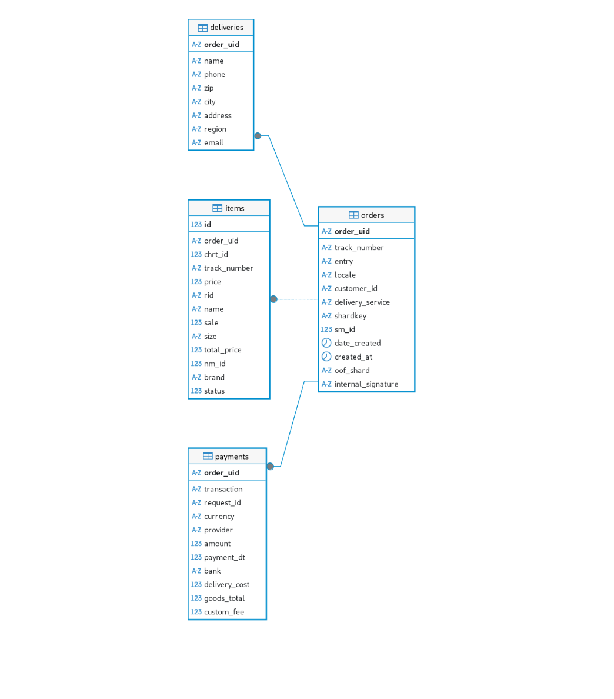

# L0 — Order Service

Микросервис для обработки заказов с использованием Kafka, PostgreSQL и кэша в памяти. 

---

## Установка

1. **Клонирование репозитория:**
    ```bash
    git clone https://github.com/makson2134/wb-tech-L0
    cd L0
    ```

2. **Создание файла .env:**
    - Скопируйте пример:
      ```bash
      cp .env.example .env
      ```
    - Или создайте вручную (пример ниже).
    

<details>
<summary>.env.example</summary>

```env
# HTTP сервер
HTTP_ADDR=:8081
HTTP_READ_TIMEOUT=30s
HTTP_WRITE_TIMEOUT=30s
HTTP_SHUTDOWN_TIMEOUT=30s

# PostgreSQL
DB_HOST=postgres
DB_PORT=5432
DB_USER=orders_user
DB_PASSWORD=orders_password
DB_NAME=orders
DB_SSLMODE=disable

# Kafka
KAFKA_BROKERS=kafka:9093
KAFKA_TOPIC=orders

# Кэш
CACHE_SIZE=200
CACHE_TTL=2m

# Rate Limiter
RATE_LIMITER_RPS=10
RATE_LIMITER_BURST=20
RATE_LIMITER_ENABLED=true

# Продюсер
PRODUCER_DATA_PATH=testdata
PRODUCER_DELAY=2s

# pprof
PPROF_ENABLED=true
PPROF_ADDR=:6060
PPROF_WEB_PORT=8080
```
</details>

3. **Запуск:**
    - Через Docker Compose:
      ```bash
      docker compose up --build
      ```
    - Альтернативно через Makefile:
      ```bash
      make up
      ```

---

## Основные команды Makefile

```bash
make up              # Запуск сервисов в фоне
make up-logs         # Запуск и просмотр логов основных сервисов
make up-kafka        # Запуск всех сервисов с логами Kafka
make up-silent       # Запуск сервисов без вывода
make down            # Остановка сервисов
make restart         # Перезапуск сервисов
make logs            # Просмотр всех логов
make logs-<service>  # Логи конкретного сервиса (например, make logs-server)
make test            # Запуск всех тестов
make test-v          # Подробные тесты
make test-cover      # Покрытие кода тестами
make build           # Сборка образов
make clean           # Полная очистка
make status          # Статус контейнеров
```

---

## Эндпоинты и интерфейсы

- **Веб-интерфейс:** [http://localhost:8081](http://localhost:8081) — HTML-страница поиска заказа по UID (`GET /`)
- **JSON API:** `GET /order/{order_uid}` — получить заказ по UID  
  Пример:
  ```bash
  curl "http://localhost:8081/order/b563feb7b2b84b6test"
  ```
- **Swagger UI:** [http://localhost:8081/swagger/](http://localhost:8081/swagger/)
- **pprof:** [http://localhost:6060/debug/pprof/](http://localhost:6060/debug/pprof/)

---

## Схема БД



- **orders** — основной заказ
- **deliveries** — доставка (1:1)
- **payments** — платеж (1:1)
- **items** — товары (1:N)

---

## Подключение к БД (например, через DBeaver)

```
jdbc:postgresql://localhost:5432/orders?user=orders_user&password=orders_password
```

---

## Тестовый продьюсер

В проекте есть отдельный сервис **producer** — генератор тестовых сообщений для Kafka.

**Принцип работы:**

- Читает файлы из папки [`testdata`](testdata):
    - `valid-order-template.json` — шаблон корректного заказа.
    - `error-*.json` — некореектные заказы с разными ошибками (например, пустой список товаров, некорректный синтаксис, отрицательная сумма и т.д.).
- В цикле с задержкой (`PRODUCER_DELAY`):
    - **2 из 3 сообщений** — генерируются на основе корректного шаблона, каждому присваивается уникальный `order_uid` и актуальное время создания.
    - **Каждое третье сообщение** — случайно выбирается один из некорректных файлов и отправляется как есть.
- Для каждого сообщения используется retry/backoff при отправке в Kafka.
- Все сообщения отправляются в указанный топик Kafka.

**Назначение:**
- Проверка работы всей цепочки: Kafka → Consumer → БД → Кеш → API.
- Проверка обработки как валидных, так и невалидных заказов.


## Используемые Go-библиотеки

- **github.com/go-chi/chi** — роутинг HTTP-запросов 
- **github.com/segmentio/kafka-go** — работа с Kafka (producer/consumer)
- **github.com/jackc/pgx/v5** — драйвер PostgreSQL (подключение и работа с БД)
- **github.com/hashicorp/golang-lru/v2** — LRU-кеш 
- **github.com/cenkalti/backoff/v4** — реализация retry/backoff для отказоустойчивости при работе с внешними сервисами
- **github.com/ilyakaznacheev/cleanenv** — для удобной загрузки конфига
- **github.com/joho/godotenv** — загрузка .env
- **github.com/google/uuid** — генерация уникальных идентификаторов 
- **github.com/stretchr/testify** — ассерт-функции и моки для unit-тестирования
- **github.com/testcontainers/testcontainers-go** — запуск временных контейнеров для интеграционных тестов (PostgreSQL, Kafka и др.)
- **golang.org/x/time/rate** — реализация rate limiter для ограничения количества запросов (используется в middleware)
- **net/http/pprof** — профилировщик
- **log/slog** — логи


---


## Документация

В папке `docs`:

- **swagger.yaml** — OpenAPI-описание REST API (генерируется автоматически)
- **swagger.json** — JSON-версия OpenAPI (для Swagger UI)
- **db_schema.png** — схема базы данных (ER-диаграмма)
- **docs.go** — автосгенерированный файл для swaggo


